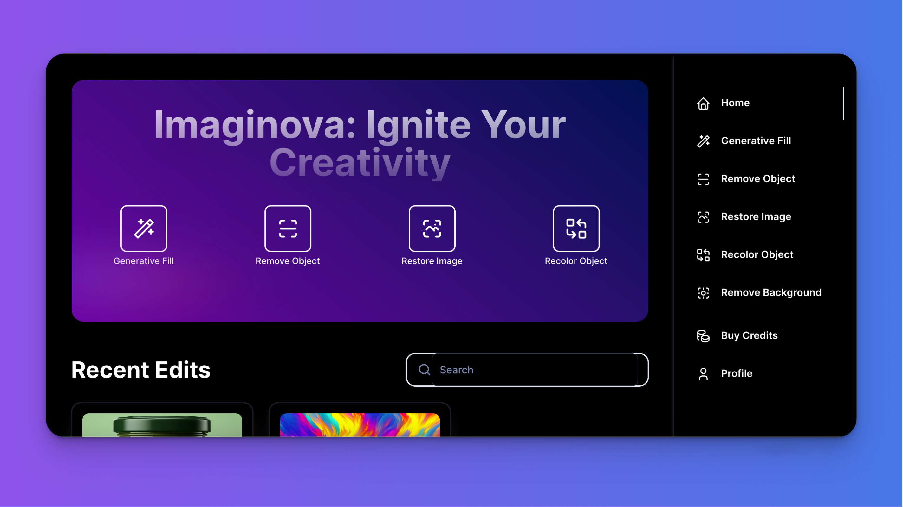

# Imaginova: Blockchain & AI-based Creative Platform for Image Manipulation

<a href="" title="Imaginova Platform">
    
</a>

### Introduction 🚀

Imaginova is an innovative blockchain-based platform designed to revolutionize how users interact with and manipulate digital images. It offers tools for modifying, recoloring, and generatively filling images, all while ensuring the security and integrity of these actions through blockchain technology. Imaginova leverages Chainlink Functions to integrate with off-chain AI modules, bringing the results back on-chain, and stores images on IPFS for decentralized and secure storage. Additionally, Imaginova features a custom subnet on the Fuji Testnet called Imaginova, connected to the C-Chain via Teleporter.

### Key Features 🌟

- **Blockchain-powered Image Manipulation**: Ensures all image modifications and enhancements are securely logged on the blockchain, providing transparency and traceability.
- **Decentralized Image Storage**: Utilizes IPFS for storing all images, ensuring data is secure, immutable, and accessible from anywhere.
- **AI Integration via Chainlink Functions**: Calls Cloudinary's AI modules off-chain for advanced image processing and brings the results back on-chain, providing powerful and scalable AI capabilities.
- **Chainlink Price Feeds**: Integrates Chainlink's price feeds to facilitate secure and accurate payment methods within the platform.
- **Flexible Membership Plans**: Offers various plans to cater to different user needs, from casual users to professional creators.
- **User-friendly Interface**: Built with React and Next.js to provide an intuitive and responsive user experience.
- **Custom Subnet Deployment**: Created a custom subnet on the Fuji Testnet called Imaginova, connected to the C-Chain using Teleporter.
- **Permissioned Subnet**: Implemented precompiles to make the subnet permissioned, allowing only certain wallets to deploy and interact with contracts.
- **Custom Gas Token**: Issued a custom gas token named Imaginova Token with tailored tokenomics and a custom gas fee structure.
- **Custom Precompiles**: Developed custom precompiles for enhanced functionality.

### Deployment Details 📜

#### Deployment Results

| Node  | Node ID                                  | RPC URL               |
| ----- | ---------------------------------------- | --------------------- |
| node1 | NodeID-7Xhw2mDxuDS44j42TCB6U5579esbSt3Lg | http://127.0.0.1:9650 |

| Deployment Results | Value                                              |
| ------------------ | -------------------------------------------------- |
| Chain Name         | imaginova                                          |
| Subnet ID          | 2XsaVtmXJnvVvj3x3X4xrCSkP9qzNi7vuRYocEfKbjyBo2Skhp |
| VM ID              | oRztSbm7S29NQyybwT33qkNWc8EnL65b2wqhAoQj8fbCwhkw4  |
| Blockchain ID      | 2r1bPth6o7ogEaJ4uFG9WKCxqggb8Gs5zDD18dTnpzkoGR8Qdv |

#### Teleporter Configuration

```json
{
  "sourceChain": {
    "id": "2XsaVtmXJnvVvj3x3X4xrCSkP9qzNi7vuRYocEfKbjyBo2Skhp",
    "rpc": "http://127.0.0.1:9650/ext/bc/2r1bPth6o7ogEaJ4uFG9WKCxqggb8Gs5zDD18dTnpzkoGR8Qdv/rpc"
  },
  "destinationChain": {
    "id": "C",
    "rpc": "http://127.0.0.1:9650/ext/bc/C/rpc"
  },
  "teleporters": [
    {
      "name": "basic",
      "enabled": true,
      "options": {
        "foo": "bar"
      }
    }
  ]
}
```

### Subnet Configuration 📁

#### Permissioned Subnet

To make the Imaginova subnet permissioned, we used precompiles to restrict deployment and interaction permissions to specific wallets.

**Example Wallet Addresses**:

- `0x68E4C2DA4Cff56FEADeC737b6291DfD935BBa84D`
- `0xYourWalletAddressHere`

**Precompile Implementation**:

1. **Precompile Contract**:

   ```solidity
   // SPDX-License-Identifier: MIT
   pragma solidity ^0.8.0;

   contract Permissioned {
       mapping(address => bool) public allowedAddresses;

       modifier onlyAllowed() {
           require(allowedAddresses[msg.sender], "Not allowed");
           _;
       }

       function addAddress(address _addr) public {
           allowedAddresses[_addr] = true;
       }

       function removeAddress(address _addr) public {
           allowedAddresses[_addr] = false;
       }

       function deployContract(bytes memory _code) public onlyAllowed returns (address addr) {
           assembly {
               addr := create(0, add(_code, 0x20), mload(_code))
           }
       }

       function interact() public view onlyAllowed returns (string memory) {
           return "Interaction allowed!";
       }
   }
   ```

2. **Integrate Precompile**:
   Integrate this precompile contract in the AvalancheGo node to enforce the permission rules on your subnet.

#### Custom Gas Token

**Token Name**: Imaginova Token (IMGN)

**Tokenomics**:

- **Total Supply**: 1,000,000 IMGN
- **Distribution**:
  - 50% for ecosystem incentives
  - 20% for development team
  - 15% for partnerships
  - 10% for marketing
  - 5% for reserve

**Custom Gas Fee Structure**:

- **Base Fee**: 1 IMGN
- **Priority Fee**: 0.1 IMGN

**Token Contract**:

```solidity
pragma solidity ^0.8.0;

import "@openzeppelin/contracts/token/ERC20/ERC20.sol";

contract ImaginovaToken is ERC20 {
    constructor(uint256 initialSupply) ERC20("Imaginova Token", "IMGN") {
        _mint(msg.sender, initialSupply);
    }
}
```

### Custom Precompiles

Custom precompiles provide additional functionalities that are executed as part of the blockchain’s native code. Here’s how you can create a custom precompile:

1. **Define the Custom Precompile**:

   ```go
   package precompiles

   import (
       "github.com/ava-labs/avalanchego/vms/components/verify"
       "github.com/ava-labs/avalanchego/vms/platformvm/txs"
       "github.com/ethereum/go-ethereum/common"
       "github.com/ethereum/go-ethereum/core/vm"
       "github.com/ethereum/go-ethereum/params"
   )

   type CustomPrecompile struct{}

   func (p *CustomPrecompile) Run(
       input []byte,
       gas uint64,
       pc *params.ChainConfig,
       height int64,
       contractAddr common.Address,
   ) ([]byte, uint64, error) {
       // Implement your precompile logic here
       return nil, gas, nil
   }
   ```

2. **Integrate with AvalancheGo**:
   Integrate your custom precompile into the AvalancheGo node and rebuild the node.

   ```bash
   cd ~/avalanchego
   go build -o build/avalanchego
   ```

3. **Deploy the Custom Node**:
   Deploy the Avalanche node with your custom precompile integrated.

   ```bash
   ./build/avalanchego --network-id=Fuji
   ```

### Hardhat Configuration ⚙️

```javascript
require("@nomicfoundation/hardhat-toolbox");
const fs = require("fs");
const privateKey = fs.readFileSync("secrete.txt").toString();
/** @type import('hardhat/config').HardhatUserConfig */
module.exports = {
  defaultNetwork: "fuji",
  networks: {
    hardhat: {
      chainId: 4202,
    },
    imaginova-fuji: {
      url: "http://127.0.0.1:9650/ext/bc/2r1bPth6o7ogEaJ4uFG9WKCxqggb8Gs5zDD18dTnpzkoGR8Qdv/rpc",
      gasPrice: 225000000000,
      chainId: 1999,
      accounts: [privateKey] ,
    },
  },
  solidity: "0.8.24",
  allowUnlimitedContractSize: true,
  throwOnTransactionFailures: true,
  throwOnCallFailures: true,
};
```

### Getting Started 📋

To set up Imaginova locally, follow these steps:

#### Prerequisites

- Node.js
- An Ethereum wallet with Ether for transaction fees
- IPFS CLI installed

#### Installation

1. Clone the repository
   ```sh
   git clone https://github.com/stugufaka/Imaginova
   ```
2. Install dependencies
   ```sh
   npm install
   ```
3. Start the development server
   ```sh
   npm run dev
   ```

### Usage Examples

- **Modifying and Recoloring Images**: Use Imaginova's tools to easily modify and recolor images. All changes are securely logged on the blockchain.
- **Generative Fill**: Leverage the AI capabilities to fill in missing parts of images creatively and intelligently.
- **Storing and Retrieving Images**: Store your images securely on IPFS and retrieve them from anywhere, ensuring both security and accessibility.

### What's Next 🗺️

- **Enhanced AI Capabilities**: Integrating more advanced AI models for even better image manipulation and creative options.
- **Mobile App Development**: Bringing Imaginova's powerful features to mobile devices for on-the-go creativity.
- **Multi-chain Support**: Expanding support to other blockchain networks to enhance platform resilience and accessibility.

### Contributing 🤝

Contributions are welcome! For major changes, please open an issue first to discuss the proposed changes. We value and appreciate all contributions to improve Imaginova.

### Acknowledgments 🎉

- Special thanks to the IPFS and Chainlink communities for their pioneering work in decentralized storage and blockchain integration.
- Gratitude to all contributors and users who help drive the continuous improvement and success of Imaginova.
